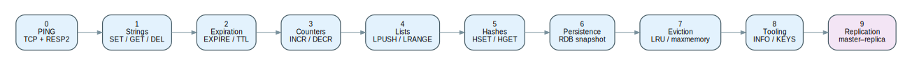
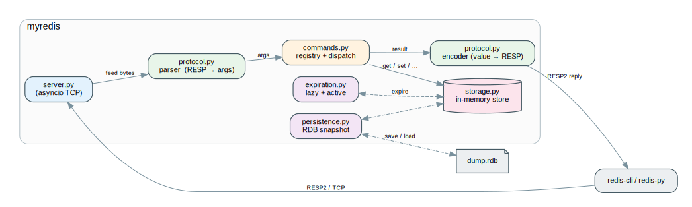
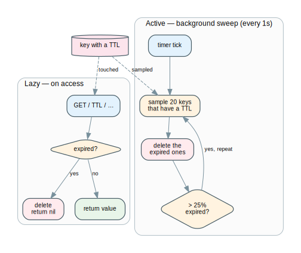

# myredis

**A Redis-compatible in-memory data store, built from scratch in Python.**

`myredis` speaks the real **RESP2** wire protocol, so the **official `redis-cli` and `redis-py` clients talk to it without knowing it isn't Redis**. It is written using **only the Python standard library** (`asyncio`) — zero external dependencies — as a deep dive into how an in-memory database actually works under the hood: the wire protocol, the event loop, key expiration, snapshotting to disk, memory eviction, and replication.

English · [Español](README.es.md)


---

## Demo

[](https://youtu.be/VIDEO_ID)

*A ~5-minute walkthrough: driving `myredis` with the official `redis-cli`, watching keys expire, persistence surviving a restart, and a tour of the architecture.*

---

## Highlights

- **Drop-in compatible** with the official Redis clients (`redis-cli`, `redis-py`) — same RESP2 wire protocol.
- **Zero dependencies** — pure Python standard library (`asyncio`, `dict`, `deque`, `OrderedDict`).
- **Incremental RESP parser** that correctly handles TCP fragmentation and command pipelining.
- **Lazy + active key expiration** — the same two-strategy approach as real Redis.
- **RDB-style persistence** with atomic snapshots that survive restarts.
- **LRU eviction** under a configurable `maxmemory`.
- **Master–replica replication** — a single-node cache turned into a small distributed system.
- **Verified against the real client**: if `redis-py` can drive it, the protocol is correct.
- Built **incrementally in 9 vertical slices** — every phase ships a program that runs and is tested end-to-end.

---

## Feature map

`myredis` was built in nine incremental phases. Each phase adds a user-facing capability and keeps the whole thing runnable and tested — never "the perfect parser before anything works", always a living program that grows.

<picture><source media="(prefers-color-scheme: dark)" srcset="diagrams/phases-dark.svg"></picture>

| Phase | Capability | Commands |
|:---:|---|---|
| **0** | RESP2 TCP server — the full request pipeline | `PING` |
| **1** | Key–value store | `SET` · `GET` · `DEL` · `EXISTS` |
| **2** | Key expiration (lazy access + active background sweep) | `EXPIRE` · `TTL` · `PERSIST` · `SET … EX/PX` |
| **3** | Atomic counters | `INCR` · `DECR` · `INCRBY` · `DECRBY` |
| **4** | Lists | `LPUSH` · `RPUSH` · `LPOP` · `RPOP` · `LLEN` · `LRANGE` |
| **5** | Hashes | `HSET` · `HGET` · `HDEL` · `HKEYS` · `HGETALL` |
| **6** | Persistence — atomic RDB snapshot | `SAVE` · `BGSAVE` |
| **7** | Memory management — LRU eviction under `maxmemory` | — |
| **8** | Introspection & tooling | `INFO` · `DBSIZE` · `FLUSHDB` · `KEYS` |
| **9** | Master–replica replication | `REPLICAOF` |

> Every phase is documented in [`docs/`](docs/) with its design rationale, edge cases, and verification steps.

---

## Architecture

A single-threaded `asyncio` event loop handles every connection.

<picture><source media="(prefers-color-scheme: dark)" srcset="diagrams/architecture-dark.svg"></picture>

| Module | Responsibility |
|---|---|
| `protocol.py` | RESP2 **encoder** (Python value -> bytes) and **incremental parser** (bytes -> command). |
| `server.py`   | `asyncio` TCP server: one coroutine per connection + a background expiration loop. |
| `commands.py` | Command **registry** and handlers; parses arguments and formats replies. |
| `storage.py`  | The in-memory store: keys -> values (`bytes`, `deque`, `dict`), plus TTL bookkeeping. |
| `expiration.py` | Lazy (on access) and active (sampled background sweep) key expiration. |
| `persistence.py` | RDB-style snapshot to disk with atomic writes; reload on startup. |

### Lifecycle of a command

Every command follows the same path, from raw RESP bytes to a RESP reply:

<picture><source media="(prefers-color-scheme: dark)" srcset="diagrams/command-lifecycle-dark.svg"></picture>

---

## Design decisions

The parts that make it more than a toy:

- **Incremental RESP parser.** TCP does not deliver one message per `read()` — a read can return half a command or several pipelined commands stuck together. The parser buffers bytes and yields complete messages, returning "need more data" when the buffer is short, so it is correct under fragmentation and pipelining.
- **Lock-free atomicity.** Because the whole server runs on one `asyncio` event loop, an operation is atomic between `await` points — no mutexes needed. (The same design in a threaded language would require explicit locking; this project makes that trade-off visible.)
- **Lazy + active expiration.** Keys are expired *lazily* when touched (correctness) **and** by an *active* background sweep that samples keys with a TTL and reclaims memory nobody is reading — the exact heuristic real Redis uses.
- **The right data structure per type.** `deque` for lists (O(1) push/pop at both ends), `OrderedDict` for LRU eviction (O(1) "move to end" / "pop oldest").
- **Crash-safe persistence.** Snapshots are written to a temp file and then atomically `os.replace`d into place — a crash mid-write never corrupts the existing snapshot.
- **Tested against the *real* client.** The integration suite launches the server and drives it with the official `redis-py` library. If the real client is satisfied, the RESP implementation is correct — not just "correct according to my own tests".

The two-strategy expiration is the trickiest piece — lazy for correctness, active to reclaim memory:

<picture><source media="(prefers-color-scheme: dark)" srcset="diagrams/expiration-dark.svg"></picture>

---

## Quickstart

```bash
git clone https://github.com/DanielMf31/myredis-python.git
cd myredis-python

python3 -m venv .venv && source .venv/bin/activate
pip install -r server/requirements.txt      # only pytest + redis-py, for the tests

cd server
python -m myredis                            # listening on 0.0.0.0:6380
```

Then, from another terminal, talk to it with the **official Redis CLI**:

```bash
redis-cli -p 6380 PING            # PONG
redis-cli -p 6380 SET user:1 dani # OK
redis-cli -p 6380 GET user:1      # "dani"
redis-cli -p 6380 SET tmp x EX 5  # expires in 5s
redis-cli -p 6380 TTL tmp         # (integer) 5
redis-cli -p 6380 RPUSH log a b c # (integer) 3
redis-cli -p 6380 LRANGE log 0 -1 # a b c
redis-cli -p 6380 INCR hits       # (integer) 1
```

---

## Verifying it works

**Run the test suite** (unit + integration against the real `redis-py` client):

```bash
cd server && source ../.venv/bin/activate
pytest -v
```

**Talk to it from Python** with the official client:

```python
import redis
r = redis.Redis(host="127.0.0.1", port=6380)
r.set("framework", "myredis")
print(r.get("framework"))         # b'myredis'
r.rpush("langs", "python", "go")
print(r.lrange("langs", 0, -1))   # [b'python', b'go']
```

**See persistence survive a restart:**

```bash
redis-cli -p 6380 SET keep me
redis-cli -p 6380 SAVE            # snapshot to disk
# stop the server (Ctrl-C) and start it again:
python -m myredis
redis-cli -p 6380 GET keep        # "me"  <- survived the restart
```

---

## Out of scope (by design)

To keep the focus on **internals** rather than reimplementing all of Redis, these are deliberately excluded: clustering / sharding, Pub/Sub, transactions (`MULTI`/`EXEC`), Lua scripting, Streams, sorted sets, AOF, RESP3, and TLS/AUTH. The goal is to understand *how the core works*, not to ship a production database.

---

## Tech stack

**Python 3.12** · `asyncio` · standard library only (`dict`, `deque`, `OrderedDict`) · **pytest** and the official **redis-py** client for testing. No frameworks, no external runtime dependencies.

> Diagrams are authored in Graphviz (`diagrams/*.dot`) and rendered to SVG — run `make -C diagrams` to regenerate them.

---

## Author

**Daniel M.F.** — mechatronics + software engineer.
[GitHub](https://github.com/DanielMf31) · [LinkedIn](LINKEDIN_URL)

Built as a hands-on study of database and systems internals. Licensed under the MIT License.
